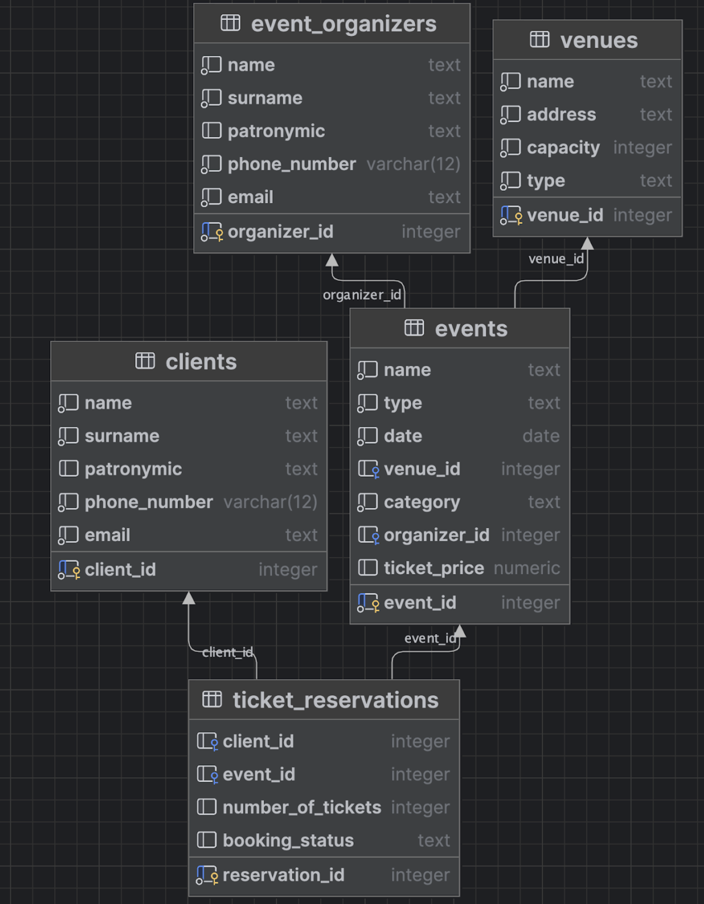

# База данных для системы учета развлекательных мероприятий

## Описание проекта

Разработана реляционная база данных для системы учета развлекательных мероприятий в соответствии с техническим заданием курсового проекта. База данных обеспечивает хранение и управление информацией о мероприятиях, местах проведения, организаторах, клиентах и бронированиях билетов.

## Технологический стек

*   **СУБД:** PostgreSQL
*   **Инструмент разработки:** DataGrip
*   **Язык:** SQL

## Структура базы данных

### Основные таблицы

*   **`clients`** - информация о клиентах:
    *   `client_id` (SERIAL, PRIMARY KEY)
    *   `name` (TEXT, NOT NULL)
    *   `surname` (TEXT, NOT NULL)
    *   `patronymic` (TEXT)
    *   `phone_number` (VARCHAR(12), NOT NULL, CHECK LIKE '+7%')
    *   `email` (TEXT, NOT NULL)

*   **`venues`** - информация о местах проведения:
    *   `venue_id` (SERIAL, PRIMARY KEY)
    *   `name` (TEXT, NOT NULL)
    *   `address` (TEXT, NOT NULL)
    *   `capacity` (INT, NOT NULL, CHECK > 0)
    *   `type` (TEXT, NOT NULL)

*   **`event_organizers`** - информация об организаторах:
    *   `organizer_id` (SERIAL, PRIMARY KEY)
    *   `name` (TEXT, NOT NULL)
    *   `surname` (TEXT, NOT NULL)
    *   `patronymic` (TEXT)
    *   `phone_number` (VARCHAR(12), NOT NULL, CHECK LIKE '+7%')
    *   `email` (TEXT, NOT NULL)

*   **`events`** - информация о мероприятиях:
    *   `event_id` (SERIAL, PRIMARY KEY)
    *   `name` (TEXT, NOT NULL)
    *   `type` (TEXT, NOT NULL)
    *   `date` (DATE, NOT NULL, DEFAULT CURRENT_DATE)
    *   `venue_id` (INT, FOREIGN KEY REFERENCES venues)
    *   `category` (TEXT, NOT NULL)
    *   `organizer_id` (INT, FOREIGN KEY REFERENCES event_organizers)
    *   `ticket_price` (NUMERIC, DEFAULT 0, CHECK >= 0)

*   **`ticket_reservations`** - информация о бронированиях:
    *   `reservation_id` (SERIAL, PRIMARY KEY)
    *   `client_id` (INT, FOREIGN KEY REFERENCES clients)
    *   `event_id` (INT, FOREIGN KEY REFERENCES events)
    *   `number_of_tickets` (INT, DEFAULT 1, CHECK > 0)
    *   `booking_status` (TEXT, CHECK IN ('подтверждено', 'отменено', 'ожидает подтверждения'))

## ER-Диаграмма

Модель "Сущность-Связь" базы данных:

 

## Связи между таблицами

*   Таблица `events` связана с:
    *   `venues` через `venue_id` (один-ко-многим)
    *   `event_organizers` через `organizer_id` (один-ко-многим)

*   Таблица `ticket_reservations` связана с:
    *   `clients` через `client_id` (один-ко-многим)
    *   `events` через `event_id` (один-ко-многим)

## Нормализация

Схема базы данных соответствует третьей нормальной форме (3NF):
- Устранены повторяющиеся группы данных
- Все неключевые атрибуты полностью зависят от первичного ключа
- Отсутствуют транзитивные зависимости между неключевыми атрибутами

## Установка и настройка

1. Создать базу данных в PostgreSQL:
```sql
CREATE DATABASE event_management_db;
```

2. Выполнить SQL-скрипт из файла `event_management_db.txt` для создания таблиц, наполнения данными и создания дополнительных объектов.

## Примеры запросов

### Найти клиентов с почтой Gmail
```sql
SELECT name, surname, patronymic 
FROM clients 
WHERE email LIKE '%gmail.com';
```

### Вывести мероприятия 2024 года
```sql
SELECT name, date 
FROM events 
WHERE EXTRACT(YEAR FROM date) = 2024;
```

### Количество забронированных билетов по категориям
```sql
SELECT e.category, SUM(t.number_of_tickets) as total_tickets
FROM events e
JOIN ticket_reservations t ON e.event_id = t.event_id
WHERE t.booking_status = 'подтверждено'
GROUP BY e.category
ORDER BY total_tickets ASC;
```

## Дополнительные объекты базы данных

### Представления
1. **v_time_and_venue** - информация о предстоящих мероприятиях (дата, место)
2. **v_clients_who_present** - клиенты, посетившие мероприятия
3. **v_events_profits** - прибыль от мероприятий с контактами организаторов

### Функции
1. **calculate_booking_cost** - расчет стоимости бронирования
2. **get_client_booking_summary** - статистика бронирований клиента
3. **get_remaining_tickets** - расчет оставшихся билетов

### Триггеры
1. **prevent_reservation_deletion** - запрет удаления бронирований
2. **log_venue_change** - логирование изменений мест проведения
3. **event_insert_stats** - статистика при добавлении мероприятия

## Заключение

База данных обеспечивает полный функционал для учета развлекательных мероприятий, соответствует требованиям нормализации и включает дополнительные объекты для удобства работы с данными. Все сущности и связи реализованы в соответствии с техническим заданием.